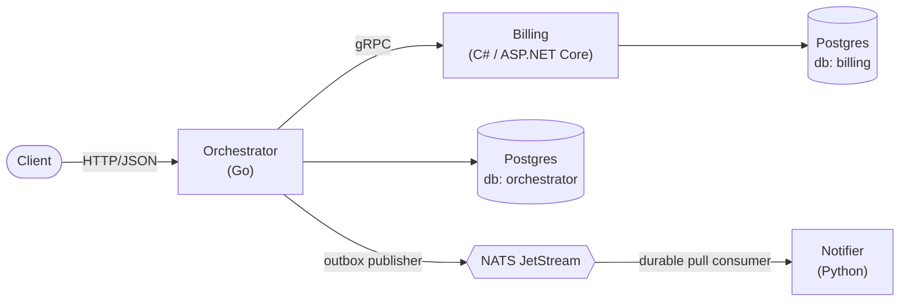
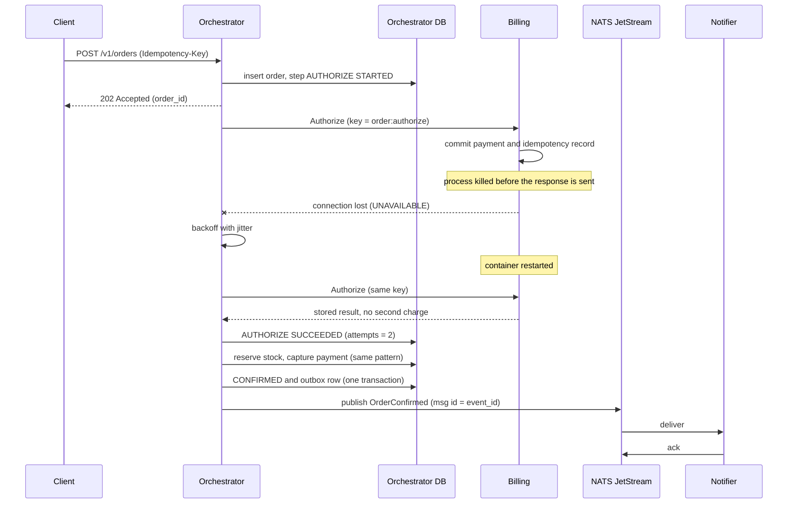

# Cartwright

> **Note:** Cartwright is a personal portfolio project built from a blank repository. It is unrelated to any employer or client work and shares no code, schemas, protobufs, or configuration with any of it.

Cartwright is a distributed saga-based order checkout system that stays consistent when its services crash mid-request. An order passes through *authorize payment → reserve stock → capture payment → confirm order*. If a step fails, the orchestrator runs compensating actions in reverse so the system always ends in a consistent state: never double-charged, never a paid order that was silently lost.

It demonstrates how to design and test for failure in a distributed workflow using:
- Orchestrated sagas with durable state and lease-based crash recovery.
- Idempotent operations and retries with backoff.
- Compensating transactions.
- Polyglot services (Go, C#, Python) connected by Protocol Buffers.
- Transactional Outbox pattern for event messaging.

## Architecture



## The Headline Test (Chaos Demo)

To run the one-command chaos testing demo, you just need Docker installed:

```bash
make up
make demo-failure
```

**What this does:**
1. Submits an order payload that contains a special fault-triggering idempotency key.
2. The Go Orchestrator begins the saga and calls the C# Billing service to Authorize the payment.
3. The C# Billing service safely commits the payment to its database and intentionally pauses for 10 seconds before returning the HTTP response.
4. The script executes a forceful `docker kill` on the Billing container to simulate a catastrophic mid-request crash.
5. The Go Orchestrator receives a connection error. It patiently executes its backoff retry logic.
6. The script brings the Billing service back online.
7. The Orchestrator reconnects and submits the same request.
8. The Billing service recognizes the Idempotency Key, queries its Postgres database, sees the payment was already safely captured before the crash, and returns the original success result *without double charging*.

### Failure Path Sequence Diagram



## Architecture Decision Records (ADRs)

Key decisions and trade-offs made in the architecture are documented here:

- [ADR 001: Orchestration over choreography](docs/adr/001-orchestration-over-choreography.md)
- [ADR 002: gRPC for saga steps, a broker for notifications](docs/adr/002-grpc-for-saga-steps-broker-for-notifications.md)
- [ADR 003: At-least-once delivery plus idempotency](docs/adr/003-at-least-once-delivery-plus-idempotency.md)
- [ADR 004: Transactional outbox](docs/adr/004-transactional-outbox.md)
- [ADR 005: Deterministic idempotency keys](docs/adr/005-deterministic-idempotency-keys.md)
- [ADR 006: Lease-based recovery with SKIP LOCKED](docs/adr/006-lease-based-recovery.md)
- [ADR 007: Python notifier](docs/adr/007-python-notifier.md)
- [ADR 008: Local inventory inside the orchestrator](docs/adr/008-local-inventory-inside-orchestrator.md)
- [ADR 009: Single-node k3s on GCP](docs/adr/009-single-node-k3s-on-gcp.md)

## Delivery and CI
- Containerized builds for all three languages.
- Complete GitHub Actions CI suite for linting, format checking, and testing (`golangci-lint`, `buf`, `dotnet test`, `pytest`).
- Infrastructure modeled as Code using **Terraform** (`deploy/terraform/gcp`) to provision a GCE instance running a single-node k3s Kubernetes cluster.
- Deployment defined as a **Helm Chart** (`deploy/helm/cartwright`).
